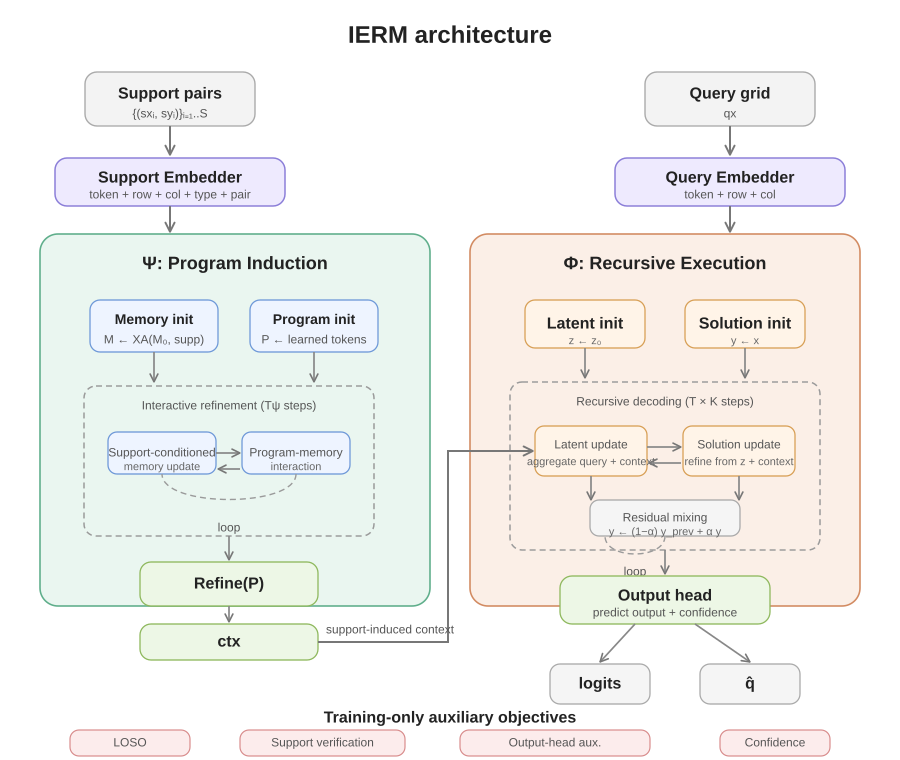

# IERM: Interactive Endomorphic Reasoning Models

Official implementation of the paper:

**IERM: Compact Interactive Endomorphic Reasoning Models for Program Induction**
*Imed Magroune, 2026*

Preprint (submitted to arXiv):  
[pdf/IERM_arXiv_v1.pdf](pdf/IERM_arXiv_v1.pdf)

Project page:  
https://magroune.net/research/ierm

---

## Overview



  
Interactive Endomorphic Reasoning Models (IERM) cast reasoning as the iterative execution of latent programs induced from small sets of support examples. The architecture separates two components:

- **Program induction (Ψ)** — infers a latent program from the task's support pairs.
- **Program execution (Φ)** — iteratively applies this program to the query state.

This separation lets compact networks (< 5M parameters) exhibit structured algorithmic behaviour without large-scale pretraining.

---

## Key Contributions

IERM introduces a compact reasoning architecture based on the explicit
separation between **program induction** and **program execution**.

Main contributions:

• **Support-induced latent programs**
  Tasks are summarized into a latent program inferred from a small set
  of support examples.

• **Iterative endomorphic reasoning**
  The same operator is recursively applied to a structured reasoning
  state, enabling multi-step inference.

• **Compact reasoning models**
  Competitive reasoning behaviour is obtained with fewer than 5M
  parameters, without large-scale pretraining.

• **Cross-domain reasoning experiments**
  The same architecture is evaluated on multiple algorithmic reasoning
  settings:
  - Sudoku Extreme
  - ARC-AGI-1
  - Maze pathfinding
  - Conway's Game of Life
  - Heat diffusion dynamics
    
## Results

| Benchmark | Setting | Score | Parameters |
|---|---|---|---|
| Sudoku Extreme (96k puzzles) | no-TTA, T=6 | 57.06% solved | 2.88M |
| Sudoku Extreme (96k puzzles) | **TTA×8** (digit-perm), T=6 | **62.92% solved** | 2.88M |
| ARC-AGI-1 public eval (400 tasks) | no-TTA, T=3 | 11.25% task-solved | 4.93M |
| ARC-AGI-1 public eval (400 tasks) | **TTA×8** (D4, voting=conf), T=3 | **12.00% task-solved** | 4.93M |

ARC-AGI-1 "task-solved" follows the official rule: a task counts as solved only if **every** test query is correctly predicted.

Additional experiments on Maze-Hard, Conway's Game of Life, and PDE dynamics are provided as notebooks (see below).

---

## Repository structure

```
IERM/
├── sudoku/              # Sudoku Extreme module
│   ├── model.py         # architecture (self-contained)
│   ├── data.py          # dataset + augmentation
│   ├── eval.py          # evaluate_sudoku()
│   └── repro.py         # CLI to reproduce the headline numbers
├── arc/                 # ARC-AGI-1 module
│   ├── model.py         # architecture (self-contained)
│   ├── data.py          # JSON loader + task_id assignment
│   ├── tta.py           # D4 + color-perm test-time augmentation
│   ├── eval.py          # official task-level evaluation
│   └── repro.py         # CLI to reproduce the headline numbers
├── notebooks/           # Maze, Conway, PDE experiments
├── scripts/             # helpers (scan_T_arc.py, etc.)
├── model_checkpoints/   # pretrained weights
├── data/                # populated by the user (see Setup)
├── results/             # JSON outputs from reproduction scripts
└── README.md
```

Both `sudoku/` and `arc/` are **self-contained**: each module defines its own primitives (RMSNorm, CrossAttention, Ψ, Φ) so that changes in one cannot break the other.

---

## Quick Start

Clone the repository and install dependencies:

git clone https://github.com/Imag2020/IERM
cd IERM

python -m venv venv
source venv/bin/activate

pip install -r requirements.txt

Download the datasets:

python data/download_sudoku.py
python data/download_arc_agi1.py

Run the main benchmarks:

python -m sudoku.repro \
    --ckpt checkpoints/sudoku_mlp_62pct.pt \
    --data_dir data/sudoku

python -m arc.repro \
    --ckpt checkpoints/arc_12pct.pt \
    --data_dir data/arc_agi1

Expected results:

Sudoku Extreme solved ≈ 0.63 (TTA×8)  
ARC-AGI-1 solved ≈ 0.12 (TTA×8)


### 2. Data


Datasets are not stored in the repository to keep it lightweight.

Download the required datasets using:

```bash
python data/download_sudoku.py
python data/download_arc_agi1.py
```

---

This will populate the following directories:

data/sudoku/
data/arc_agi1/

Datasets used:

Sudoku Extreme
https://huggingface.co/datasets/sapientinc/sudoku-extreme
ARC-AGI-1
https://github.com/fchollet/ARC-AGI

Maze hard dataset and Conway + PDE-HEAT datasets scripts are available in notebooks.


### 4. Checkpoints

Pretrained weights are available in the [Releases](../../releases) section of this repository, or directly in `model_checkpoints/` if cloned with LFS. The two checkpoints needed to reproduce the paper numbers are:

- `model_checkpoints/sudoku_mlp_62pct.pt` — 2.88M parameters
- `model_checkpoints/checkpoints_support_only_ft_lastshot/best_ema.pt` — 4.93M parameters

---

## Reproduction


All numbers reported below correspond to the checkpoints released in this repository.

### Sudoku Extreme

```bash
python -m sudoku.repro \
    --ckpt       checkpoints/sudoku_mlp_62pct.pt \
    --data_dir   data/sudoku \
    --pred_T     6 \
    --n_tta      8 \
    --max_batches 3000 \
    --save_json  results/sudoku_eval.json
```

**Runtime**: ~3 min no-TTA + ~33 min TTA×8 on a single RTX-class GPU (96 000 puzzles total).

**Expected output**:

```
SUDOKU EXTREME — HEADLINE NUMBERS
  no-TTA   | solved=0.5706  px=0.8730  empty=0.8163
  TTA×8    | solved=0.6292  px=0.8926  empty=0.8448
  TTA lift on grid_solved: +0.0586
```

### ARC-AGI-1

```bash
python -m arc.repro \
    --ckpt      checkpoints/arc_12pct.pt \
    --data_dir  data/arc_agi1 \
    --pred_T    3 \
    --save_json results/arc_eval.json
```

**Runtime**: ~2 min no-TTA + ~12 min TTA×8 on a single RTX-class GPU.

**Expected output**:

```
ARC-AGI-1 PUBLIC EVAL — HEADLINE NUMBERS
  no-TTA   | solved = 0.1125  queries = 0.1122  (47/419 correct)
  TTA×8    | solved = 0.1200  queries = 0.1217  (51/419 correct)
  TTA lift on task-solved: +0.0075
```

**Important**: `--data_dir` must contain **both** `training/` and `evaluation/`. The training set is not used for gradient computation at eval time, but it is required to compute the correct `task_id` offset (=400). Our task-embedding table `emb_task(2048)` was trained with `task_id ∈ [0..399]` for training tasks and `task_id ∈ [400..799]` for evaluation tasks. Using the wrong offset would misalign the embeddings and drop the score significantly.

---

## Notebooks

Additional experiments are provided as Jupyter notebooks under `notebooks/`:

- `maze_ablation.ipynb` — Maze-Hard 30×30 stress test. The model captures global path topology but leaves residual noise (~24–40 false-positive pixels adjacent to the path). Included as a transparent report of model limitations; TRM (Jolicoeur-Martineau, 2025) achieves 85.3% solved on this benchmark with a self-attention architecture better suited to large grids.
- `conway_reasoning.ipynb` — Conway's Game of Life rule inference from example transitions.
- `heat_equation_reasoning.ipynb` — 2D heat diffusion dynamics learned from a handful of support trajectories.

These notebooks are self-contained and reproduce the figures in the paper.

---

## Training

The code released here focuses on **inference reproducibility**. Training scripts with their exact hyperparameters and curriculum will be released in a follow-up update. If you need early access for research purposes, please open an issue.

---


## Acknowledgements

We thank the open ARC community and prior work on algorithmic
reasoning benchmarks for making these evaluation environments
publicly available.

## Citation

If this work is useful to you, please cite:

```bibtex
@article{magroune2026ierm,
  title   = {IERM: Interactive Reasoning via Support-Induced Latent Programs},
  author  = {Magroune, Imed},
  journal = {arXiv preprint},
  year    = {2026},
  note    = {arXiv ID to be added}
}
```

The bibtex will be updated with the arXiv identifier upon preprint release.

---

## Paper

arXiv: *coming soon*

---


## Project Status

This repository contains the reference implementation used for the
experiments reported in the IERM paper.

The code is provided for research and reproducibility purposes.
It is not intended to be a general-purpose library.

Training pipelines and additional experiments may evolve as the
research progresses.

## License

MIT (see [LICENSE](LICENSE)) — feel free to build on this work, with attribution.

---

## Contact

Questions, issues, reproducibility concerns: please open a GitHub issue or contact the author directly.